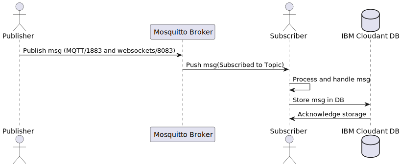
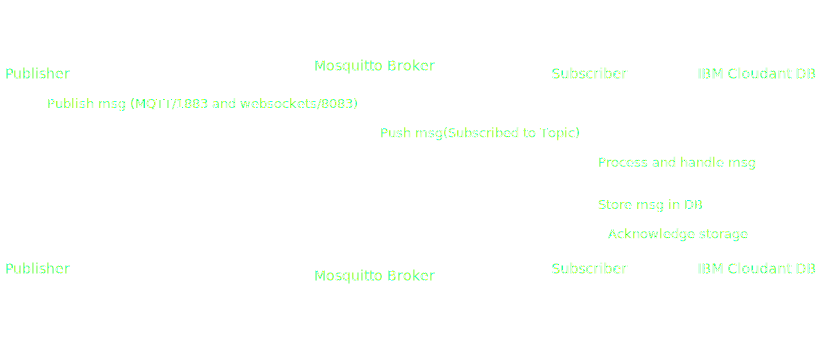

# mqtt-demo

Demo of using the Mosquitto MQTT broker and a subscriber application to forward messages to IBM Cloudant

## Sequence diagram

<!--  -->

<picture>
    <source srcset="./docs/sequence-diagram_light.svg" media="(prefers-color-scheme: dark)">
    <source srcset="./docs/sequence-diagram_dark.svg" media="(prefers-color-scheme: light)">
    
</picture>

## Build and deploy the mosquitto broker

To build your own mosquitto MQTT broker container image and deploy it on IBM Code Engine, follow the steps documented in the [mosquitto folder](./mosquitto/) of this repo.

## Deploy the subscriber app

Likewise there are instructions to deploy the Python subscriber app on IBM Code Engine in the [subscriber folder](./subscriber/) of this repo.

## Publish message

Finally, there's a sample publisher app, that publishes messages on the mosquitto broker. Use the [publisher folder](./publisher/) of this repo.
